# 🌐 Net Gestão - Sistema de Gestão de grupos de networking

Sistema completo para gerenciamento de redes de negócios focado em conectar profissionais, gerar oportunidades comerciais e acompanhar o desempenho de membros através de indicações, reuniões e métricas de performance.

<h3>Imagens do Projeto</h3>

<h4>Desktop</h4>
<p>
  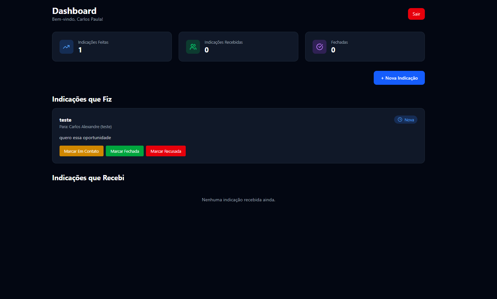
  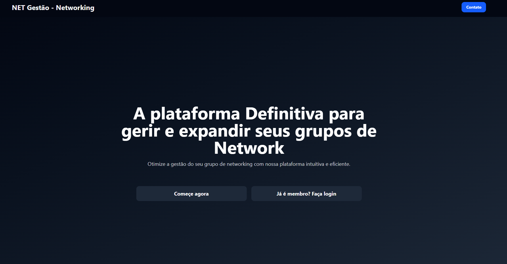
  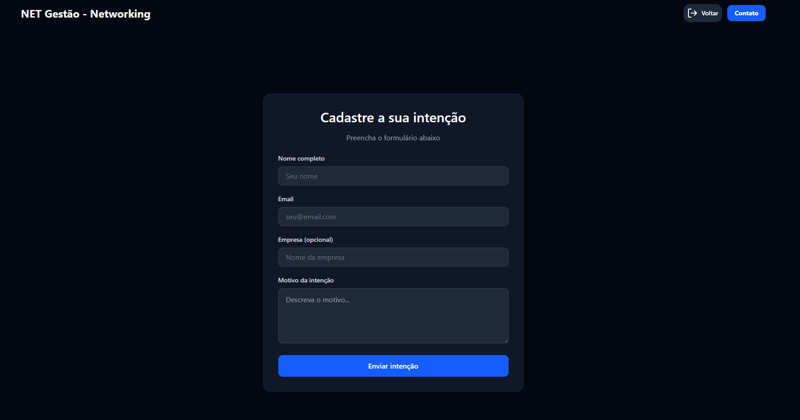
  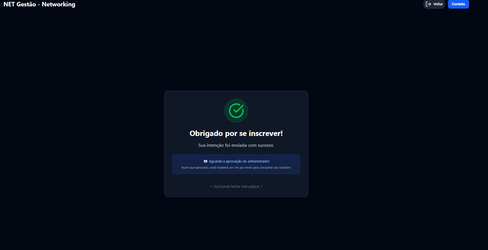
  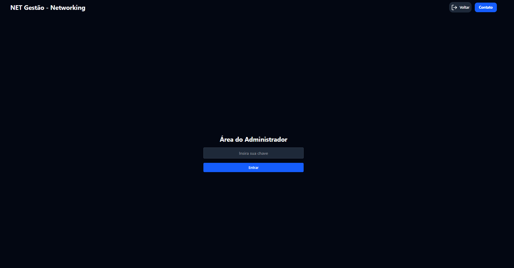
  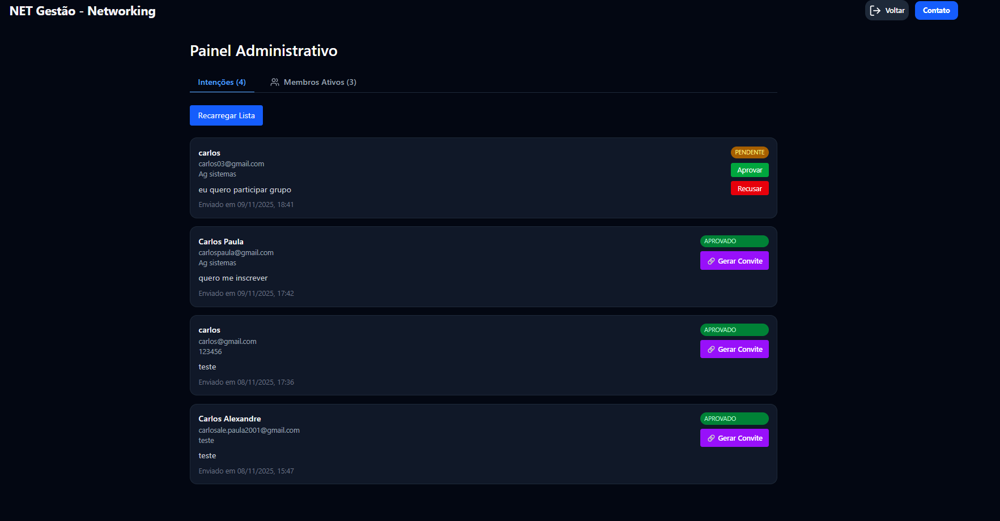
  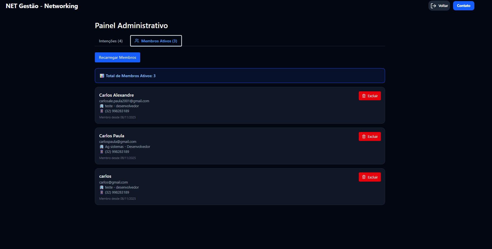
  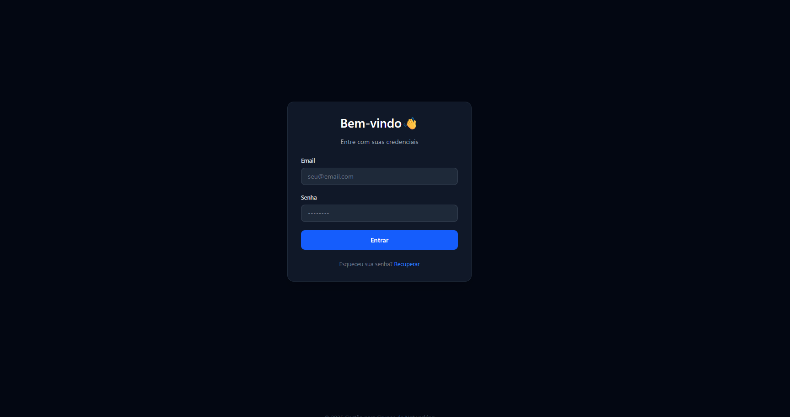  
  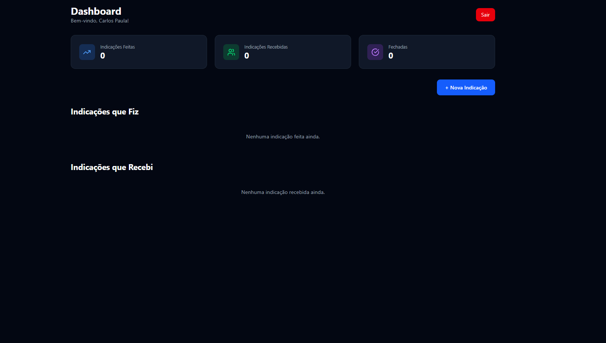
  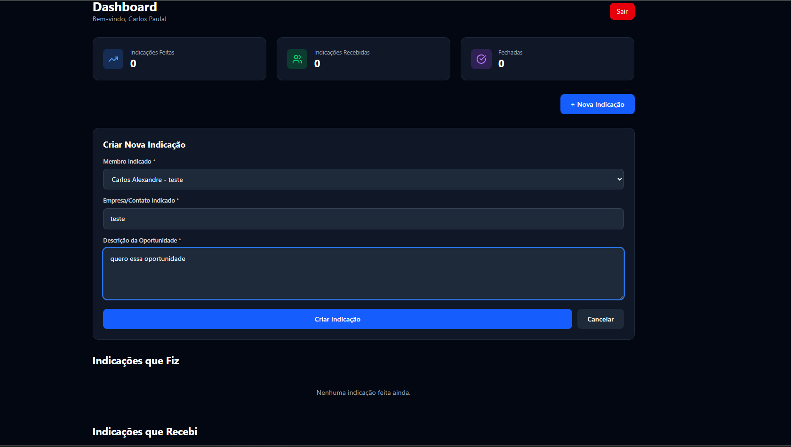
</p>

---

## 🎯 Sobre o Projeto

O **Net Gestão** é uma plataforma web desenvolvida para facilitar a gestão de grupos de networking profissional. O sistema permite:

- **Cadastro controlado**: Processo de aprovação de novos membros com sistema de convites
- **Dashboard de membros**: Área exclusiva para acompanhamento de atividades
- **Sistema de indicações**: Geração e acompanhamento de oportunidades de negócio entre membros
- **Gestão administrativa**: Painel para aprovação de membros e controle da rede

### 🔄 Fluxo de Cadastro

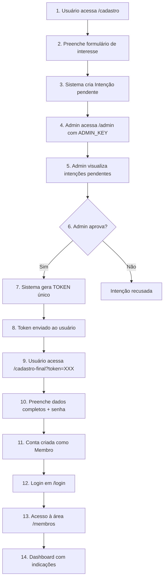

**Resumo do Fluxo:**
1. 📝 **Manifestação de Interesse**: `/cadastro` - Formulário público (nome, email, empresa, motivo)
2. ⏳ **Intenção Pendente**: Sistema aguarda aprovação administrativa
3. 🔐 **Painel Admin**: `/admin` - Login com `ADMIN_KEY` (variável de ambiente)
4. ✅ **Aprovação**: Admin aprova a intenção e sistema gera **token único**
5. 🎟️ **Convite com Token**: Link `/cadastro-final?token=abc123def456` enviado ao candidato
6. 📋 **Cadastro Final**: Candidato completa dados (cargo, telefone, senha)
7. 🔓 **Login**: `/login` - Acesso com email e senha
8. 🏠 **Área de Membros**: `/membros` - Dashboard com indicações e estatísticas

---

## ✨ Funcionalidades

### ✅ Implementadas (MVP - Fase 1)

#### Gestão de Membros
- ✅ Formulário público de manifestação de interesse
- ✅ Validação de email duplicado
- ✅ Painel administrativo para aprovação de intenções
- ✅ Geração automática de tokens únicos para convites
- ✅ Cadastro completo de membros via token
- ✅ Autenticação segura com bcrypt (hash de senhas)
- ✅ Sistema de login com validação de credenciais

#### Sistema de Indicações
- ✅ Criação de indicações entre membros
- ✅ Acompanhamento de status (Nova, Em Contato, Fechada, Recusada)
- ✅ Visualização separada de indicações feitas vs recebidas
- ✅ Atualização de status em tempo real
- ✅ Dashboard com estatísticas de indicações

#### Interface
- ✅ Design responsivo com TailwindCSS
- ✅ Animações suaves com Framer Motion
- ✅ Componentes reutilizáveis (Cards, Inputs, Buttons)
- ✅ Feedback visual para ações do usuário

---

## 🚀 Tecnologias Utilizadas

### Frontend
- **[Next.js 16.0.1](https://nextjs.org/)** - Framework React com SSR e App Router
- **[React 19.2.0](https://react.dev/)** - Biblioteca JavaScript para interfaces
- **[TypeScript 5.9.3](https://www.typescriptlang.org/)** - Superset tipado do JavaScript
- **[TailwindCSS 4](https://tailwindcss.com/)** - Framework CSS utilitário
- **[Framer Motion 12.23.24](https://www.framer.com/motion/)** - Biblioteca de animações
- **[Lucide React 0.552.0](https://lucide.dev/)** - Ícones SVG otimizados
- **[React Hook Form 7.66.0](https://react-hook-form.com/)** - Gerenciamento de formulários
- **[Zod 4.1.12](https://zod.dev/)** - Validação de schemas TypeScript

### Backend
- **[Next.js API Routes](https://nextjs.org/docs/app/building-your-application/routing/route-handlers)** - Endpoints serverless
- **[Prisma 6.19.0](https://www.prisma.io/)** - ORM type-safe para Node.js
- **[MongoDB](https://www.mongodb.com/)** - Banco de dados NoSQL
- **[bcrypt 6.0.0](https://www.npmjs.com/package/bcrypt)** - Hash de senhas
- **[crypto (Node.js)](https://nodejs.org/api/crypto.html)** - Geração de tokens seguros

### DevOps e Ferramentas
- **[ESLint 9](https://eslint.org/)** - Linter JavaScript/TypeScript
- **[Vitest](https://vitest.dev/)** - Framework de testes unitários
- **[Testing Library](https://testing-library.com/)** - Biblioteca de testes para React
- **[Vercel](https://vercel.com/)** - Plataforma de deploy (recomendado)
- **[MongoDB Atlas](https://www.mongodb.com/atlas)** - Banco de dados na nuvem

### UI/UX
- **[Radix UI](https://www.radix-ui.com/)** - Componentes acessíveis headless
- **[class-variance-authority](https://cva.style/)** - Utilitário para variantes CSS
- **[clsx](https://www.npmjs.com/package/clsx) + [tailwind-merge](https://www.npmjs.com/package/tailwind-merge)** - Manipulação de classes CSS

---

## 📦 Pré-requisitos

Antes de começar, certifique-se de ter instalado em sua máquina:

- **[Node.js](https://nodejs.org/)** (versão 18.x ou superior)
- **[npm](https://www.npmjs.com/)** ou **[yarn](https://yarnpkg.com/)** ou **[pnpm](https://pnpm.io/)**
- **[Git](https://git-scm.com/)**
- Conta no **[MongoDB Atlas](https://www.mongodb.com/atlas)** (ou MongoDB local)

---

## ⚙️ Instalação e Configuração

### 1. Clone o Repositório

```bash
# Se tiver repositório no GitHub
git clone https://github.com/seu-usuario/net-gestao.git
cd net-gestao

# Ou navegue até a pasta do projeto se já tiver baixado
cd net-gestao
```

### 2. Instale as Dependências

```bash
npm install
# ou
yarn install
# ou
pnpm install
```

### 3. Configure as Variáveis de Ambiente

Crie um arquivo `.env` na raiz do projeto:

```env
# Database MongoDB
DATABASE_URL="mongodb+srv://;...."

# Autenticação
ADMIN_KEY="sua_chave_secreta_admin_aqui"
```

#### Como obter a DATABASE_URL:

1. Acesse [MongoDB Atlas](https://www.mongodb.com/atlas)
2. Crie um cluster gratuito (M0)
3. Vá em **Database** → **Connect** → **Connect your application**
4. Copie a connection string e substitua `<password>` pela sua senha e usuario pelo nome
5. Cole no arquivo `.env`

#### Defina uma ADMIN_KEY:

- Escolha uma senha forte para acesso administrativo
- Exemplo: `ADMIN_KEY="MinhaChaveSecreta123!"`

### 4. Configure o Prisma e o Banco de Dados

```bash
# Gera o Prisma Client
npx prisma generate

# Sincroniza o schema com o MongoDB (cria as collections)
npx prisma db push
```

> **Nota**: O comando `prisma db push` é usado para MongoDB. Ele sincroniza o schema sem criar migrations.

---

## 🎮 Como Rodar o Projeto

### Modo Desenvolvimento

```bash
npm run dev
```

A aplicação estará disponível em **[http://localhost:3000](http://localhost:3000)**

### 🚀 Primeiros Passos - Guia Rápido

Após rodar o projeto, siga este caminho para testar o sistema completo:

#### 1️⃣ Criar uma Intenção de Cadastro
```
1. Acesse: http://localhost:3000/cadastro
2. Preencha o formulário:
   - Nome: João Silva
   - Email: joao@email.com
   - Empresa: Empresa XYZ
   - Motivo: Quero fazer networking
3. Clique em "Enviar Manifestação"
4. ✅ Intenção criada com status "pendente"
```

#### 2️⃣ Acessar Painel Administrativo
```
1. Acesse: http://localhost:3000/admin
2. Digite a ADMIN_KEY configurada no .env
   (exemplo: "MinhaChaveSecreta123!")
3. Visualize a lista de intenções pendentes
```

#### 3️⃣ Aprovar Intenção e Gerar Token
```
1. No painel admin, localize a intenção de "João Silva"
2. Clique em "Aprovar"
3. ✅ Sistema gera token único automaticamente
4. Copie o link gerado: 
   http://localhost:3000/cadastro-final?token=abc123def456
```

#### 4️⃣ Completar Cadastro com Token
```
1. Acesse o link com token (ou cole no navegador)
2. Preencha os dados adicionais:
   - Cargo: Gerente de Vendas
   - Telefone: (11) 98765-4321
   - Senha: senha123
   - Confirmar Senha: senha123
3. Clique em "Finalizar Cadastro"
4. ✅ Conta de membro criada!
```

#### 5️⃣ Fazer Login
```
1. Acesse: http://localhost:3000/login
2. Digite as credenciais:
   - Email: joao@email.com
   - Senha: senha123
3. Clique em "Entrar"
4. ✅ Redirecionado para área de membros
```

#### 6️⃣ Acessar Dashboard de Membros
```
1. Você está em: http://localhost:3000/membros
2. Visualize:
   - Lista de todos os membros da rede
   - Criar nova indicação para outros membros
   - Ver indicações recebidas
   - Ver indicações feitas
   - Atualizar status das indicações
```

> 💡 **Dica**: Para testar indicações, crie pelo menos 2 membros seguindo os passos acima.

### Rodar Testes

```bash
# Executa todos os testes uma vez
npm test

# Executa os testes em modo watch (reexecuta ao salvar)
npm run test:watch

# Abre a interface visual do Vitest
npm run test:ui

# Gera relatório de cobertura de testes
npm run test:coverage
```

**Estrutura de Testes:**
- `tests/api.test.ts` - Testes das rotas de API (intenções, indicações, login)
- `tests/components.test.tsx` - Testes de componentes React (Button, SuccessCard)
- `tests/setup.ts` - Configuração global dos testes (mocks, cleanup)

### Modo Produção (Build)

```bash
# Gera o build otimizado
npm run build

# Inicia o servidor de produção
npm start
```

### Rodar o Prisma Studio (Visualizador de Dados)

```bash
npx prisma studio
```

Abre uma interface visual para visualizar e editar dados do banco em **[http://localhost:5555](http://localhost:5555)**

---

## 📁 Estrutura do Projeto

```
net-gestao/
├── src/
│   ├── app/                      # App Router (Next.js 14+)
│   │   ├── api/                  # API Routes (Backend)
│   │   │   ├── auth/             # Autenticação admin
│   │   │   ├── convite/          # Geração/validação de convites
│   │   │   ├── indicacoes/       # CRUD de indicações
│   │   │   ├── intencoes/        # CRUD de intenções
│   │   │   └── membros/          # Login e listagem de membros
│   │   ├── admin/                # Painel administrativo
│   │   ├── cadastro/             # Formulário público de intenção
│   │   ├── cadastro-final/       # Cadastro completo com token
│   │   ├── login/                # Login de membros
│   │   ├── membros/              # Dashboard de membros
│   │   ├── components/           # Componentes específicos de páginas
│   │   ├── globals.css           # Estilos globais
│   │   ├── layout.tsx            # Layout raiz
│   │   └── page.tsx              # Página inicial
│   ├── components/               # Componentes compartilhados
│   │   └── ui/                   # Componentes de UI (shadcn/ui)
│   ├── config/                   # Configurações
│   │   └── prisma.ts             # Cliente Prisma singleton
│   └── lib/                      # Utilitários
│       ├── utils.ts              # Funções auxiliares
│       └── validations.ts        # Schemas de validação Zod
├── prisma/
│   └── schema.prisma             # Schema do banco de dados
├── generated/
│   └── prisma/                   # Prisma Client gerado
├── public/                       # Arquivos estáticos
├── .env                          # Variáveis de ambiente (não versionar!)
├── architetrure.md               # Documentação de arquitetura
├── components.json               # Configuração shadcn/ui
├── next.config.ts                # Configuração Next.js
├── package.json                  # Dependências do projeto
├── postcss.config.mjs            # Configuração PostCSS
├── prisma.config.ts              # Configuração Prisma
├── README.md                     # Este arquivo
├── tailwind.config.ts            # Configuração TailwindCSS
└── tsconfig.json                 # Configuração TypeScript
```

---

## 🔌 APIs Disponíveis

### Autenticação

#### `POST /api/auth`
Validação de chave de administrador

**Body**:
```json
{
  "adminKey": "sua_chave_admin"
}
```

#### `POST /api/membros/login`
Login de membro

**Body**:
```json
{
  "email": "membro@email.com",
  "password": "senha123"
}
```

**Response**:
```json
{
  "success": true,
  "member": { /* dados do membro */ },
  "token": "abc123def456"
}
```

---

### Gestão de Membros

#### `POST /api/intencoes`
Criar intenção de cadastro (público)

**Body**:
```json
{
  "nome": "João Silva",
  "email": "joao@email.com",
  "empresa": "Empresa XYZ",
  "motivo": "Quero fazer parte da rede"
}
```

#### `GET /api/intencoes`
Listar intenções pendentes (admin)

**Headers**:
```
x-admin-key: sua_chave_admin
```

#### `PATCH /api/intencoes/[id]`
Aprovar/recusar intenção (admin)

**Body**:
```json
{
  "status": "aprovado" // ou "recusado"
}
```

#### `POST /api/convite/gerar`
Gerar convite com token (admin)

**Body**:
```json
{
  "intencaoId": "id_da_intencao"
}
```

#### `GET /api/convite/validar?token=abc123`
Validar token de convite

#### `POST /api/convite/registrar`
Cadastro completo de membro

**Body**:
```json
{
  "token": "abc123def456",
  "nome": "João Silva",
  "email": "joao@email.com",
  "password": "senha123",
  "empresa": "Empresa XYZ",
  "cargo": "Gerente",
  "telefone": "(11) 98765-4321"
}
```

#### `GET /api/membros`
Listar todos os membros

---

### Sistema de Indicações

#### `POST /api/indicacoes`
Criar nova indicação

**Body**:
```json
{
  "membroIndicadorId": "id_do_indicador",
  "membroIndicadoId": "id_do_indicado",
  "empresaContato": "Empresa ABC",
  "descricao": "Oportunidade de consultoria"
}
```

#### `GET /api/indicacoes?membroId=xxx`
Listar indicações de um membro (feitas + recebidas)

#### `PATCH /api/indicacoes/[id]`
Atualizar status da indicação

**Body**:
```json
{
  "status": "em_contato" // nova, em_contato, fechada, recusada
}
```

---

## 🔐 Variáveis de Ambiente

| Variável | Descrição | Obrigatória | Exemplo |
|----------|-----------|-------------|---------|
| `DATABASE_URL` | Connection string do MongoDB | ✅ Sim | `mongodb+srv://...` |
| `ADMIN_KEY` | Chave secreta para acesso admin | ✅ Sim | `MinhaChaveSecreta123!` |

---

## 🌐 Deploy

### Deploy na Vercel (Recomendado)

1. Faça push do código para o GitHub
2. Acesse [vercel.com](https://vercel.com)
3. Importe o repositório
4. Configure as variáveis de ambiente:
   - `DATABASE_URL`
   - `ADMIN_KEY`
5. Deploy automático! ✨

### Deploy Manual

```bash
# Build do projeto
npm run build

# Inicie o servidor
npm start
```

O servidor estará rodando na porta 3000 por padrão.

---

## 📚 Documentação Adicional

- **[architetrure.md](./architetrure.md)** - Documentação completa da arquitetura do sistema
- **[Next.js Docs](https://nextjs.org/docs)** - Documentação oficial do Next.js
- **[Prisma Docs](https://www.prisma.io/docs)** - Documentação do Prisma ORM
- **[TailwindCSS Docs](https://tailwindcss.com/docs)** - Documentação do TailwindCSS

---

## 🛠️ Scripts Disponíveis

```bash
# Desenvolvimento
npm run dev          # Inicia servidor de desenvolvimento

# Produção
npm run build        # Gera build de produção
npm start            # Inicia servidor de produção

# Qualidade de Código
npm run lint         # Executa ESLint

# Prisma
npx prisma generate  # Gera Prisma Client
npx prisma db push   # Sincroniza schema com banco
npx prisma studio    # Abre interface visual do banco
```

---

## 👨‍💻 Autor

**Carlos Paula**

---

**Versão**: 1.0.0  
**Última Atualização**: 09/11/2025
