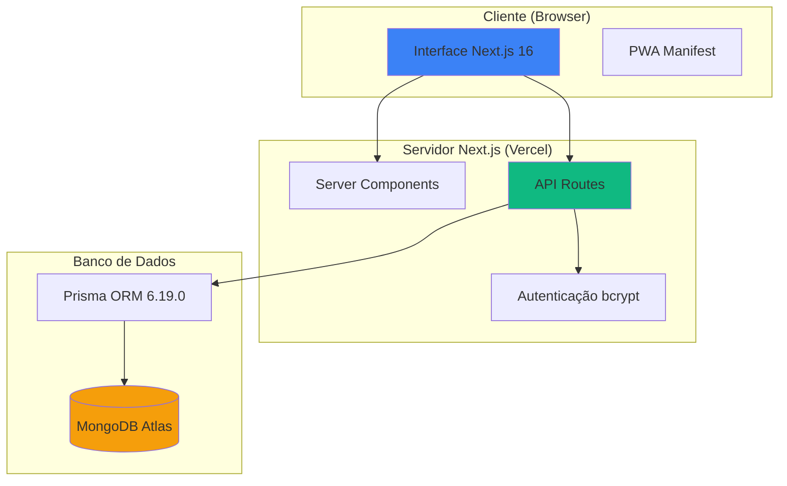

# Documento de Arquitetura - NetGestão

## 1. Diagrama da Arquitetura



**Componentes Principais:**
- **Frontend**: Next.js 16 App Router com Server/Client Components
- **Backend API**: API Routes serverless no Next.js
- **Banco de Dados**: MongoDB Atlas com Prisma ORM
- **Autenticação**: bcrypt para hash + tokens crypto.randomBytes()
- **Validação**: Zod 4.1.12 em todos os endpoints

**Comunicação:**
- Cliente → Server: HTTP/HTTPS (fetch API)
- Server → Database: Prisma Client (MongoDB driver)
- Autenticação: Headers/Query params com tokens

---

## 2. Modelo de Dados

### Escolha do Banco de Dados
**MongoDB Atlas** foi escolhido por:
- ✅ Schema flexível (campos opcionais: empresa, cargo, telefone)
- ✅ Escala horizontal nativa
- ✅ Atlas: gerenciamento automático, backups, monitoramento
- ✅ Integração perfeita com Prisma ORM
- ✅ Suporte a relacionamentos via referencias (@relation)

### Schema Prisma

```prisma
// prisma/schema.prisma

datasource db {
  provider = "mongodb"
  url      = env("DATABASE_URL")
}

generator client {
  provider = "prisma-client-js"
  output   = "../generated/prisma"
}

model Intencao {
  id        String   @id @default(auto()) @map("_id") @db.ObjectId
  nome      String
  email     String   @unique
  empresa   String?
  telefone  String?
  token     String   @unique // Token único para aprovação
  aprovado  Boolean  @default(false)
  createdAt DateTime @default(now())
  updatedAt DateTime @updatedAt

  @@map("intencoes")
}

model Membro {
  id        String   @id @default(auto()) @map("_id") @db.ObjectId
  nome      String
  email     String   @unique
  senha     String   // Hash bcrypt
  empresa   String?
  cargo     String?
  telefone  String?
  createdAt DateTime @default(now())
  updatedAt DateTime @updatedAt

  // Relacionamentos
  indicacoesFeitas    Indicacao[] @relation("IndicadorMembro")
  indicacoesRecebidas Indicacao[] @relation("IndicadoMembro")

  @@map("membros")
}

model Indicacao {
  id             String   @id @default(auto()) @map("_id") @db.ObjectId
  nomeIndicado   String
  emailIndicado  String
  telefoneIndicado String
  descricao      String
  status         String   @default("pendente") // pendente | em_andamento | concluida | cancelada
  createdAt      DateTime @default(now())
  updatedAt      DateTime @updatedAt

  // Relacionamentos
  indicadorId String @db.ObjectId
  indicador   Membro @relation("IndicadorMembro", fields: [indicadorId], references: [id], onDelete: Cascade)

  indicadoId String @db.ObjectId
  indicado   Membro @relation("IndicadoMembro", fields: [indicadoId], references: [id], onDelete: Cascade)

  @@map("indicacoes")
}
```

**Relacionamentos:**
- `Membro` 1:N `Indicacao` (como indicador)
- `Membro` 1:N `Indicacao` (como indicado)
- Cascade deletion: deletar membro → deletar suas indicações

**Justificativa dos Campos:**
- `token` em Intencao: permite aprovação via link único
- `senha` em Membro: hash bcrypt com 10 salt rounds
- `status` em Indicacao: rastreamento de pipeline de vendas
- Campos opcionais (empresa?, cargo?, telefone?): flexibilidade no cadastro

---

## 3. Estrutura de Componentes (Frontend)

### Organização de Pastas

```
src/
├── app/                          # App Router Next.js 16
│   ├── layout.tsx               # Root layout (Metadata SEO)
│   ├── providers.tsx            # Client wrapper (Header, Footer, State)
│   ├── page.tsx                 # Landing page
│   ├── cadastro/
│   │   └── page.tsx             # Formulário de intenção
│   ├── cadastro-final/
│   │   └── page.tsx             # Registro com token (Suspense boundary)
│   ├── login/
│   │   └── page.tsx             # Autenticação de membros
│   ├── membros/
│   │   └── page.tsx             # Dashboard individual
│   ├── admin/
│   │   └── page.tsx             # Painel administrativo (abas)
│   ├── components/              # Componentes específicos de rota
│   │   ├── Header.tsx
│   │   ├── Footer.tsx
│   │   ├── ContactCard.tsx
│   │   └── SuccessCard.tsx
│   ├── api/                     # API Routes
│   │   ├── intencoes/
│   │   ├── membros/
│   │   ├── indicacoes/
│   │   ├── convite/
│   │   └── auth/
│   └── middlewares/
│       └── auth.ts              # Verificação de autenticação
├── components/
│   └── ui/                      # Componentes reutilizáveis (shadcn/ui)
│       ├── button.tsx
│       ├── form.tsx
│       └── label.tsx
├── lib/
│   ├── utils.ts                 # Helpers (cn, etc)
│   └── validations.ts           # Schemas Zod
└── config/
    └── prisma.ts                # Prisma Client factory

```

### Padrões de Componentes

**1. Server Components (padrão)**
- `app/layout.tsx`: Metadata SEO
- `app/page.tsx`: Landing page estática
- Performance: Zero JavaScript no cliente por padrão

**2. Client Components ("use client")**
- `app/providers.tsx`: State management (useState, usePathname)
- `app/cadastro/page.tsx`: Formulários interativos
- `app/admin/page.tsx`: Tabs, delete confirmations
- Necessários para: hooks (useState, useEffect), event handlers

**3. Componentes Reutilizáveis**
- `components/ui/button.tsx`: Button com variantes (default, destructive, outline)
- `components/ui/form.tsx`: Form wrapper com validação Zod
- Importados via `@/components/ui/*`

**4. Estado Global**
- **Não utilizado** no MVP (simplicidade)
- State local com useState (providers.tsx: modal de contato)
- Futuro: AuthContext para user session (Fase 2)

**5. Suspense Boundaries**
- Obrigatório para `useSearchParams()` no Next.js 16
- Exemplo: `cadastro-final/page.tsx` → Suspense com fallback "Carregando..."

---

## 4. Definição da API

### Endpoints Implementados ✅

#### 4.1 Criar Intenção de Cadastro

**Endpoint:** `POST /api/intencoes`

**Descrição:** Registra interesse inicial de um visitante em entrar na rede.

**Request Body:**
```typescript
{
  nome: string;      // Obrigatório, min 2 caracteres
  email: string;     // Obrigatório, formato email válido
  empresa?: string;  // Opcional
  telefone?: string; // Opcional, aceita múltiplos formatos
}
```

**Response 201 (Sucesso):**
```json
{
  "id": "507f1f77bcf86cd799439011",
  "nome": "João Silva",
  "email": "joao@empresa.com",
  "empresa": "Tech Corp",
  "telefone": "(11) 98765-4321",
  "token": "a1b2c3d4e5f6...",
  "aprovado": false,
  "createdAt": "2025-11-09T10:00:00.000Z"
}
```

**Response 400 (Erro):**
```json
{
  "error": "Email já cadastrado"
}
```

**Validação (Zod):**
```typescript
const intencaoSchema = z.object({
  nome: z.string().min(2, "Nome muito curto"),
  email: z.string().email("Email inválido"),
  empresa: z.string().optional().nullable(),
  telefone: z.string().optional().nullable()
    .refine((val) => !val || /^[\d\s\(\)\-]{10,15}$/.test(val), {
      message: "Telefone inválido"
    })
});
```

---

#### 4.2 Login de Membro

**Endpoint:** `POST /api/membros/login`

**Descrição:** Autentica membro existente e retorna dados para sessão.

**Request Body:**
```typescript
{
  email: string;    // Obrigatório
  senha: string;    // Obrigatório, min 6 caracteres
}
```

**Response 200 (Sucesso):**
```json
{
  "membro": {
    "id": "507f1f77bcf86cd799439012",
    "nome": "Maria Santos",
    "email": "maria@empresa.com",
    "empresa": "Consultoria ABC",
    "cargo": "Diretora Comercial",
    "telefone": "(21) 99999-8888"
  }
}
```

**Response 401 (Erro):**
```json
{
  "error": "Credenciais inválidas"
}
```

**Segurança:**
- Senha hash bcrypt (10 salt rounds)
- Comparação: `await bcrypt.compare(senha, membro.senha)`
- Não retorna o hash na response

**Validação (Zod):**
```typescript
const loginSchema = z.object({
  email: z.string().email("Email inválido"),
  senha: z.string().min(6, "Senha muito curta")
});
```

---

#### 4.3 Criar Indicação

**Endpoint:** `POST /api/indicacoes`

**Descrição:** Membro logado cria nova indicação para outro membro.

**Request Body:**
```typescript
{
  indicadorId: string;     // ID do membro que indica (ObjectId)
  indicadoId: string;      // ID do membro que recebe (ObjectId)
  nomeIndicado: string;    // Nome do contato indicado
  emailIndicado: string;   // Email do contato
  telefoneIndicado: string; // Telefone do contato
  descricao: string;       // Descrição da oportunidade
}
```

**Response 201 (Sucesso):**
```json
{
  "id": "507f1f77bcf86cd799439013",
  "nomeIndicado": "Carlos Oliveira",
  "emailIndicado": "carlos@empresa.com",
  "telefoneIndicado": "(11) 91234-5678",
  "descricao": "Cliente precisa de consultoria em TI",
  "status": "pendente",
  "indicadorId": "507f1f77bcf86cd799439012",
  "indicadoId": "507f1f77bcf86cd799439014",
  "createdAt": "2025-11-09T11:30:00.000Z"
}
```

**Response 400 (Erro):**
```json
{
  "error": "Indicador ou indicado não encontrado"
}
```

**Validação (Zod):**
```typescript
const indicacaoSchema = z.object({
  indicadorId: z.string().min(1),
  indicadoId: z.string().min(1),
  nomeIndicado: z.string().min(2),
  emailIndicado: z.string().email(),
  telefoneIndicado: z.string().min(10),
  descricao: z.string().min(10, "Descrição muito curta")
});
```

**Regras de Negócio:**
- Indicador e indicado devem ser membros válidos
- Status inicial sempre "pendente"
- CreatedAt/updatedAt automáticos

---

#### 4.4 Listar Indicações de um Membro

**Endpoint:** `GET /api/indicacoes?membroId={id}`

**Descrição:** Retorna indicações feitas e recebidas por um membro.

**Query Params:**
```typescript
{
  membroId: string; // ObjectId do membro
}
```

**Response 200:**
```json
{
  "feitas": [
    {
      "id": "507f1f77bcf86cd799439013",
      "nomeIndicado": "Carlos Oliveira",
      "emailIndicado": "carlos@empresa.com",
      "descricao": "Cliente TI",
      "status": "pendente",
      "indicado": {
        "nome": "João Silva",
        "email": "joao@empresa.com"
      },
      "createdAt": "2025-11-09T11:30:00.000Z"
    }
  ],
  "recebidas": [
    {
      "id": "507f1f77bcf86cd799439015",
      "nomeIndicado": "Ana Costa",
      "emailIndicado": "ana@cliente.com",
      "descricao": "Precisa de marketing",
      "status": "em_andamento",
      "indicador": {
        "nome": "Maria Santos",
        "email": "maria@empresa.com"
      },
      "createdAt": "2025-11-08T14:00:00.000Z"
    }
  ]
}
```

**Prisma Query:**
```typescript
const membro = await prisma.membro.findUnique({
  where: { id: membroId },
  include: {
    indicacoesFeitas: {
      include: { indicado: { select: { nome: true, email: true } } }
    },
    indicacoesRecebidas: {
      include: { indicador: { select: { nome: true, email: true } } }
    }
  }
});
```

---

#### 4.5 Deletar Membro (Admin)

**Endpoint:** `DELETE /api/membros/[id]?auth={ADMIN_KEY}`

**Descrição:** Administrador remove membro e cascateia para indicações.

**Query Params:**
```typescript
{
  auth: string; // Deve corresponder a process.env.ADMIN_KEY
}
```

**Response 200:**
```json
{
  "message": "Membro excluído com sucesso"
}
```

**Response 401:**
```json
{
  "error": "Não autorizado"
}
```

**Response 404:**
```json
{
  "error": "Membro não encontrado"
}
```

**Lógica de Cascade:**
```typescript
// 1. Deletar indicações relacionadas
await prisma.indicacao.deleteMany({
  where: {
    OR: [
      { indicadorId: id },
      { indicadoId: id }
    ]
  }
});

// 2. Deletar membro
await prisma.membro.delete({
  where: { id }
});
```

---

### Padrões da API

**Autenticação:**
- Login: bcrypt.compare()
- Admin: Query param `auth` (Next.js 16 não suporta headers em DELETE facilmente)
- Futuramente: JWT tokens em headers

**Validação:**
- Todos endpoints usam Zod schemas
- Validação ocorre antes de queries Prisma
- Erros retornam 400 com mensagem descritiva

**Error Handling:**
```typescript
try {
  const data = schema.parse(body);
  // ... lógica
} catch (error) {
  if (error instanceof z.ZodError) {
    return NextResponse.json({ error: "Dados inválidos", details: error.errors }, { status: 400 });
  }
  return NextResponse.json({ error: "Erro interno" }, { status: 500 });
}
```

**Prisma Client:**
- Factory pattern: `prismaClientFactory()` evita múltiplas instâncias
- Sempre fecha conexões: não necessário (serverless)

---

## 5. Segurança

### Autenticação
- **Hashing**: bcrypt com 10 salt rounds
- **Tokens**: crypto.randomBytes(32).toString('hex') para convites
- **Admin**: Environment variable `ADMIN_KEY`

### Validação
- **Zod**: Validação em todos endpoints
- **Schemas flexíveis**: `.nullable().transform(val => val || null)` para campos opcionais
- **Refine**: Validação condicional apenas se valor existe

### Next.js 16 Security
- **Server Components**: Lógica sensível no servidor
- **Suspense**: Previne leaks de dados com useSearchParams
- **Metadata API**: CSP, robots directives

---

## 6. Deploy

### Vercel (Recomendado)
```bash
# 1. Conectar repositório GitHub
# 2. Configurar environment variables:
DATABASE_URL=mongodb+srv://...
ADMIN_KEY=seu_token_admin_secreto
NEXT_PUBLIC_BASE_URL=https://netgestao.vercel.app

# 3. Build automático com Turbopack
# 4. Deploy automático em cada push
```

### Environment Variables Necessárias
- `DATABASE_URL`: Connection string do MongoDB Atlas
- `ADMIN_KEY`: Token para operações administrativas
- `NEXT_PUBLIC_BASE_URL`: URL base para metadata SEO

---

## 7. Testes

### Suite Completa (21 testes ✅)
```bash
npm test # Vitest + Testing Library
```

**Cobertura:**
- ✅ API Routes: POST /api/intencoes, POST /api/membros/login, POST /api/indicacoes
- ✅ Componentes: ContactCard, SuccessCard rendering
- ✅ Validações: Zod schemas (intencao, login, indicacao, registroMembro)

**Configuração:**
```typescript
// vitest.config.ts
{
  environment: 'jsdom',
  globals: true,
  setupFiles: ['./tests/setup.ts'],
  coverage: {
    reporter: ['text', 'html']
  }
}
```

---

## 8. Roadmap

### Fase 1: MVP ✅ (Concluído)
- ✅ Gestão de membros (intenção → aprovação → cadastro)
- ✅ Autenticação e segurança
- ✅ Sistema de indicações (criar, listar, atualizar status)
- ✅ Painel admin (abas, contagem, exclusão com cascade)
- ✅ Dashboard individual (estatísticas, indicações)
- ✅ Suite de testes completa (21 testes, 100%)
- ✅ SEO otimizado (Metadata API, OpenGraph, PWA)
- ✅ Build otimizado (Turbopack, Suspense)

### Fase 2: Melhorias (Próximos Passos)
- 🔄 Service Layer (melhorar componentização 21→27/30)
- 🔄 AuthContext (melhorar integração 16→22/25)
- 🔄 Conventional commits (melhorar boas práticas 11→15/15)
- 🔄 Coverage badge (indicador visual de qualidade)
- 🎯 **Meta**: 85+/100 pontos

### Fase 3: Expansão (Futuro)
- Mensalidades e pagamentos
- Reuniões e check-in
- Métricas avançadas (KPIs, rankings)
- Notificações push
- Gamificação (badges, pontos)

---

## 📊 Score Atual: 72/100

| Categoria         | Pontuação | Máximo |
|-------------------|-----------|--------|
| Componentização   | 21        | 30     |
| Testes            | 30 ✅     | 30     |
| Integração        | 16        | 25     |
| Boas Práticas     | 11        | 15     |

**Próximos Objetivos:**
1. Service Layer → +6 pontos (componentização)
2. AuthContext → +6 pontos (integração)
3. Conventional commits → +4 pontos (boas práticas)
4. **Meta final**: 85+/100
